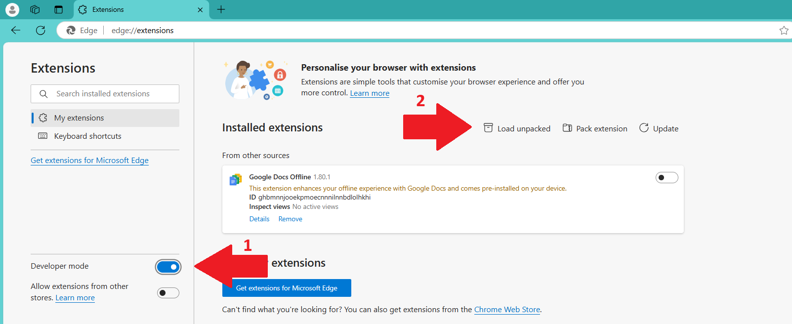

# Projet de Data Extracting Tool
### Contexte
Ce projet est à des fins purement éducatives, personnelles et non lucratives. Il est réalisé dans le cadre de mon stage de validation de Master 1 Informatique.

### Description
Ce programme est une extension web destinée à faciliter la recherche de profils sur LinkedIn. Je n'assurerai pas la maintenance de cette application.

## Les technologies
Dans cette partie, les différents aspects du programme seront détaillés.

## Le programme
+ HTML : pour réaliser l'interface.
+ CSS : pour le style de l'interface.
+ JavaScript : pour l'ensemble des fonctions.
### Les fichiers
+ popup.html : Interface de l'extension.
+ popup.css : Fichier de style de l'interface.
+ popup.js : Fichier de gestion des fonctions de la page web.
+ background.js : Fichier de sauvegarde des profils des différentes pages.
+ manifest.json : Fichier descriptif de l'extension pour le navigateur.
### Environnement de développement
+ Visual Studio Code.
+ Git : pour le contrôle des versions.
+ Asana : pour la gestion de projet.

## Étude
Le programme étant réalisé dans le cadre d'un stage en gestion de projet, j'introduis ici cet aspect.

### Les besoins
* Trouver des profils.
Pour la recherche :
* Par mots-clés.
* Par poste (regroupement des intitulés de poste).
* Résultats enregistrables.
* Interface graphique.
* Liens vers les profils.
### Les données
Ce programme est capable de sauvegarder les informations des profils dans un fichier CSV exploitable par tous les tableurs. Les données devraient être :

* Lien du profil.
* Nom complet.
* Localisation.
* Descriptif.

## Installation
Cette extension est conçue pour fonctionner sur Microsoft Edge, les protocoles étant les mêmes que sur Chrome.

1. Télécharger l'extension à jour.
2. Extraire le dossier "extension" de l'archive.
3. Installer l'extension dans votre navigateur : Lien pour Edge :
  1. Rendez-vous dans la section "Extensions" de votre navigateur.
  {width=50%}
  2. Activez le mode développeur.
  {width=50%}
  3. Cliquez sur "Charger une extension décompressée" en haut de la section des extensions.
  4. Une fenêtre va s'ouvrir, choisissez le dossier "extension" que vous venez de télécharger.
  5. Activez l'extension.
  {width=50%}
4. L'extension est prête à être utilisée.

## Documentation
### L'interface
L’utilisateur clique sur l’icône de l’extension, ce qui ouvre une petite fenêtre (l'interface). On y trouve :

+ Un menu déroulant lorsque l'on passe la souris sur "réseaux" avec deux options : une pour se rendre sur le site de LinkedIn, et l’autre sur le site d’Indeed.
+ À côté du bouton déroulant se trouve un champ pour que l’utilisateur entre le poste des profils recherchés. L’utilisateur doit d’abord entrer sa recherche avant de cliquer sur l’un des choix du menu déroulant. Cela ouvre une page vers les profils recherchés ou vers la page de connexion du site.
+ Un bouton de collecte qui sert à sauvegarder la page sur laquelle l’utilisateur se trouve. Les profils seront sauvegardés dans un fichier CSV exploitable par la majorité des tableurs.
+ Un champ après le bouton de collecte permet d'indiquer le nombre de pages que l'on souhaite sauvegarder. De petits boutons à droite de ce champ permettent d'incrémenter ou de décrémenter le nombre de pages à collecter.

### Le code
Certains paramètres sont configurés directement dans le code. J'ai ajouté des commentaires afin de faciliter la compréhension.
Le tri par région est paramétré directement dans la construction de la requête URI.

## Problèmes possibles
* Parfois, le logiciel Excel ne lit pas correctement le fichier CSV et ne sépare pas les champs.
  1. Il faut ouvrir une nouvelle page Excel.
  2. Trouver l'option "Importer les données" dans le menu Excel.
  3. Un menu s'ouvre, et il faut configurer le séparateur sur la virgule ",".
  4. Valider l'import, la séparation devrait être correcte.